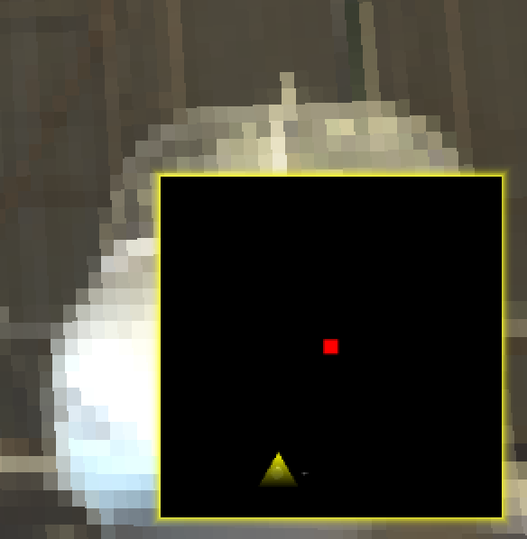
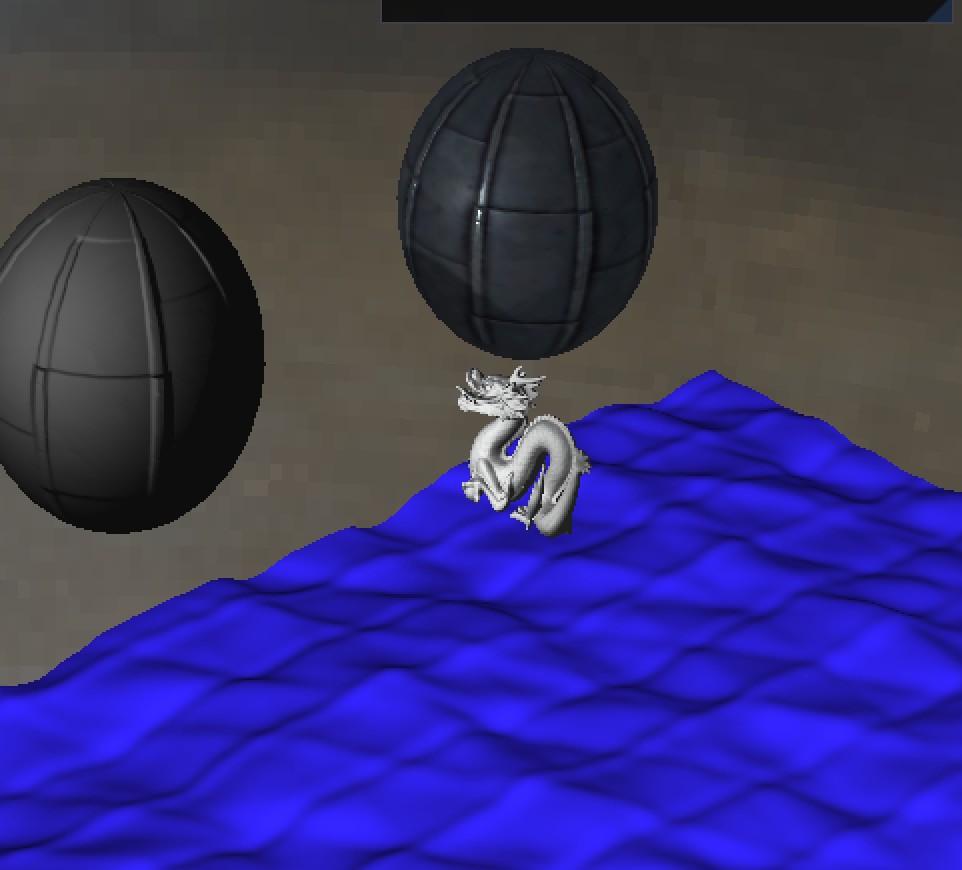
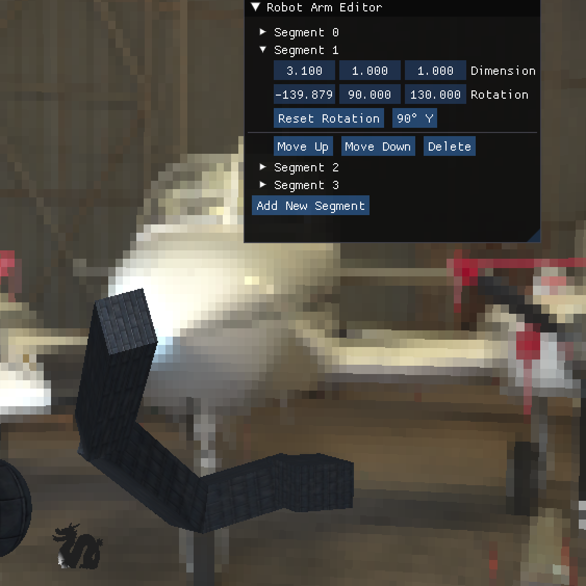
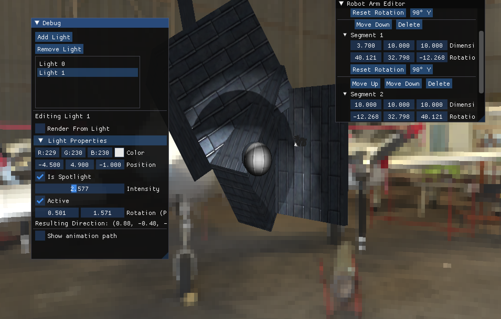
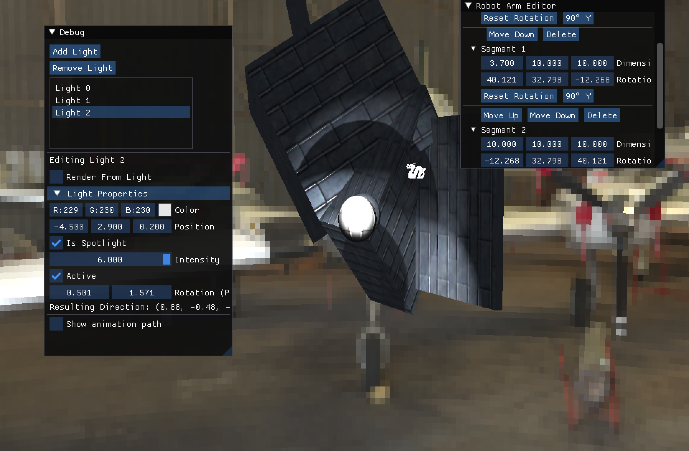
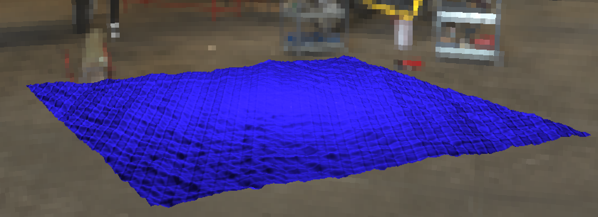
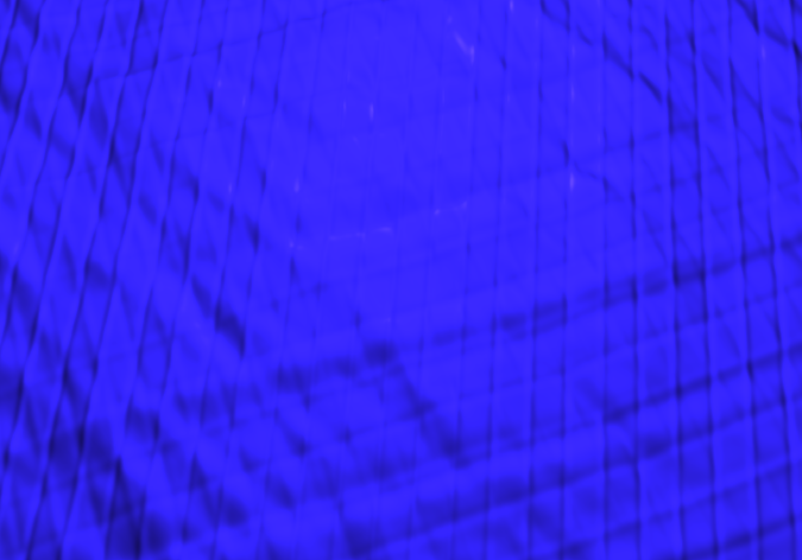

# CS4515 Assignment 2 - Tech Demo Report

## Team Members & Work Distribution

### Henry Nguyen
- PBR Shading and Normal Mapping and Material Textures and Ambient Occlusion - 100%
- Multiple Viewpoints & Minimap - 100%
- Procedural Water - 100%
- Environment Mapping - 100%
- Multiple Light Source Shadows - 100%
- Recording the video - 100%

### Karen Situ
- Post processing effects - 100%
- Implementing the debugging UI + robots UI - 100%
- Hierarchical Transformations - 100%
- Smooth Paths (Bezier Curves) with constant speed - 100%
- General project setup and management - 100%
- Writing the report + screenshots - 100%

## Features
Italicized features are extra.

### 1. Multiple Viewpoints & *Minimap*
3 viewpoints: render from light, viewpoints as edited by user mouse interaction, minimap

**Technical Approach:**  
We store `renderingFromLighView` to toggle between view from each light and the view that the user moved to with mouse interactions. Turning this on sets the viewpoint to the selected light's position .

The minimap is in the corner. To implement the minimap, we render the scene from a camera that's directly above the player, looking exactly down. This camera renders to a small 256x256 texture. In the second pass, we render a quad with the minimap texture on it. The quad is rendered in the bottom right corner of the screen.

**Screenshots:**
- Toggling between rendering from light and user's viewpoint: 
  
- Minimap:
  

### 2. Advanced Shading (PBR) with Normal Mapping
We used PBR shading equations given in the lecture and in other rendering resources online [0]. The PBR model takes in several input parameters, which we can also use textures as input for. We also implemented normal mapping to perturb the normals of the object based on a normal map texture.

This makes the object look more realistic, even for Blinn Phong shading. 

[0]: https://learnopengl.com/PBR/Theory

**Screenshots:**


- 

### 3. Material Textures
PBR rendering depends on several input parameters, like metallic and roughness. We can use textures to represent these parameters. We also implemented ambient occlusion and normal mapping. We downloaded a free-use texture from the Internet that provides all these values as images. This is shown on the metal sphere. 

**Technical Approach:**  
Class `PBRMaterial` to manage:
```cpp
Texture base_color;
std::optional<Texture> normal_map;
std::optional<Texture> roughness;
std::optional<Texture> metallic;
std::optional<Texture> ambient_occlusion;
```

We implemented shader `brdf_frag.glsl` with helpers and functions `getBaseColor`, `calculateAmbientBRDF`, `calculateLightingBRDF` that takes in the material textures and calculates the final color of the fragment.

**Screenshots:**
- pbr side
  
- pbr front
  
  
### 4. Environment Mapping
We implemented environment mapping using a cubemap. We used a free-use HDRI image from the Internet. The HDRI image uses an equirectangular projection,
which we convert to a cubemap. We then use the cubemap to reflect the environment on the metal sphere.

To do this, we simply render a massive cube around the player. In the fragment shader, we calculate the spherical angle based on the current fragment coordinate. Then, we use these spherical coordinates to look up the color in the HDRI texture.

**Screenshots:**
- perspective 1 
  
- perspective 2 
  
- perspective 3
  


### 5. Smooth Paths (Bézier Curves) with *Constant Speed Bézier Curve Movement*
Dragon moves along path made of 3 Bezier curves, one curve for each loop.

**Technical Approach:**  
Class `BezierPath` stores the path's control points and implements arc-length parameterization for constant-speed movement. The path is built using three connected cubic Bézier curves that form a looping pattern at `z=1.5`. We use a lookup table with 1000 samples to map arc length to curve parameters, enabling smooth movement at constant velocity regardless of the curve's shape. 

Class `PathAnimation` manages movement timing and automatically wraps around at the path's end. We render the path using OpenGL line strips with a dedicated shader from `shaders/bezier`, and the path visualization can be toggled through `animationPathsVisible` in `GPUMeshCollection`.

**Screenshots:**
- Smooth path, constant speed
  
- Path rendering off
  

### 6. Hierarchical Transformations
Editable robot arm composed of multiple segments that can be manipulated through rotation and scaling transformations. Each segment's transformation affects all subsequent segments in the chain.

**Technical Approach:**  
Class `RobotSegment` manages individual arm segments with dimensions and rotations. `RobotSegmentList` handles the hierarchical chain. We use matrix multiplication to propagate transformations, where each segment's position depends on all previous segments' transformations. An interactive UI allows runtime manipulation of each segment's Euler angles and dimensions. The system supports adding new segments, reordering them, and deleting segments. The robot arm starts at a default position with four default segments of varying sizes and rotations about different axes.

**Screenshots:**
- Editing a parent's length
  
- Rotated same parent
  

### 7. Multiple Light Source Shadows
We simply adapted code from Assignment 1 Part 1 that handles shadows. Instead of having just one shadow map, we have a shadow map for each light source. We render the scene from the light's perspective and store the depth values in a texture. We then render the scene from the camera's perspective and use the shadow map to determine if a fragment is in shadow or not. If a fragment is in shadow, then we simply exclude that light from being applied to that fragment.

**Screenshots:**
- two lights 
- three lights 

### 8. Post-processing Effects
We did a very simple glow effect around the minimap to make it more prominent. The glow effect is implemented in the fragment shader, which reserves the border of the quad as the "glow", and the center as the "minimap". The glow is simply a linear interpolation between bright yellow on the inside and transparent on the outside border.

**Screenshots:**
- minimap glow 1
  
- minimap glow 2
  

### 9. Procedural Water Surface
There is a sheet of wavy water below the main objects of the scene. We built a massive vertex mesh grid that covers the surface of the water. We pass into the vertex shader an array of waves (with amplitude, phase, speed, and sharpness levels) that are added together to create the final wave height. We then use the wave height to displace the vertex positions in the y-direction. We also pass in the time to the shader to animate the waves.

**Screenshots:**
- water
  
- more water
  

### 10. Ambient Occlusion
We implemented ambient occlusion with the PBR shader. It takes in an ambient occlusion texture that we use to darken the areas where light is less likely to reach. We use the ambient occlusion texture to adjust the ambient lighting term in the PBR shader.

**Screenshots:**
- behind
  
- front
  
